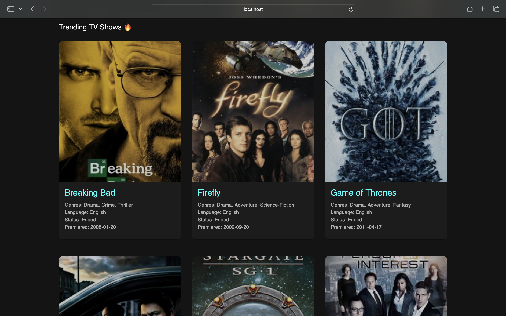
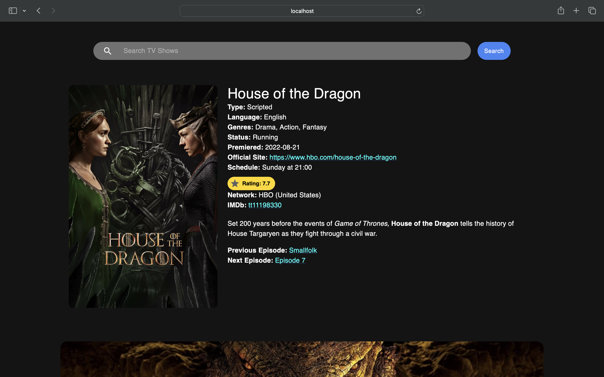

# TV Show Finder

TV Show Finder is a React web application that allows users to search for TV shows and view detailed information about them. The app uses the TVmaze API to fetch data about TV shows and display them in a modern, user-friendly interface.

## Features

- Search for TV shows by name
- View a list of trending TV shows with ratings
- Click on a TV show to view detailed information
- Responsive design for mobile and desktop
- Dark theme with modern UI components

## Screenshots

    
    
  

